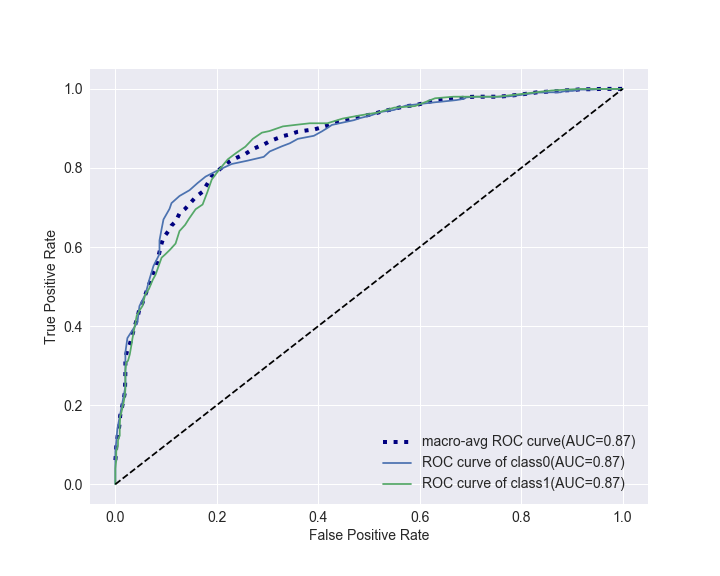

# ks_gini_cap30_AUC

## 簡介
此為計算模型結果參數工具，包含計算ks,gini,cap30,AUC及ROC curve畫圖：

  
* ks_gini_cap30_AUC:
  存放主要程式碼
* data_processing:
  demo資料處理程式碼
* example:
  存放demo檔

## 參數介紹
* ks:
* gini:
* cap30: \
  依照預測機率排序，前30%數據包含全體數據多少預測正確。
* AUC: \
  ROC曲線下方的面積（Area under the Curve of ROC (AUC)），其意義是： \
  若隨機抽取一個陽性樣本和一個陰性樣本，分類器正確判斷陽性樣本的值高於陰性樣本之機率。簡單說：AUC值越大的分類器，正確率越高。 \

  從AUC判斷分類器（預測模型）優劣的標準： \
  AUC = 1，是完美分類器，採用這個預測模型時，存在至少一個閾值能得出完美預測。絕大多數預測的場合，不存在完美分類器。 \
  0.5 < AUC < 1，優於隨機猜測。這個分類器（模型）妥善設定閾值的話，能有預測價值。 \
  AUC = 0.5，跟隨機猜測一樣（例：丟銅板），模型沒有預測價值。 \
  AUC < 0.5，比隨機猜測還差；但只要總是反預測而行，就優於隨機猜測。
  
## Document
class ks_gini_cap30_AUC.ks_gini_cap30_AUC(classes,model_predict_proba,y,do_cate=True)

**Parameters:**
* classes:int,類別個數
* model_predict_proba:array,模型預測機率值
* y:array,真實結果
* do_cate:bool,是否類別化
  
**Methods:**
* calculate_auc(self, num = 1)
  * Parameters: \
  **num:int,類別代號**
* calculate_cap30(self, num = 1)
  * Parameters: \
  **num:int,類別代號**
* calculate_ks(self, num = 1)
  * Parameters: \
  **num:int,類別代號**
* calculate_gini(self, num = 1)
  * Parameters: \
  **num:int,類別代號**
* calculate_all(self, num = 1)
  * Parameters: \
  **num:int,類別代號**
* calculate_detail(self, num = 1)
  * Parameters: \
  **num:int,類別代號**
* ROC_AUC_plot(self, Title='', figsize = (10,8), fontsize = 12, save = None)
  * Parameters: \
  **Title:str,圖片標題** \
  **figsize:(float,float),圖片長寬大小** \
  **fontsize:float,字體大小** \
  **save:str,儲存圖檔名稱(None時不存檔)**

## Demo
例子存放於example中，以下介紹：

#### 輸入套件
```python
import numpy as np
import pandas as pd
from sklearn.ensemble import RandomForestClassifier
from sklearn.model_selection import train_test_split
import warnings
warnings.filterwarnings("ignore")
```

#### 輸入資料
```python
data_x = pd.read_csv('data\data_x.csv')
data_y = pd.read_csv('data\data_y.csv')
```

#### train & test set
```python
train_x , test_x , train_y , test_y = train_test_split(data_x, data_y, test_size=0.2, random_state=42)
```

#### 建立RandomForest Model
```python
clf = RandomForestClassifier(n_estimators=100,
                             n_jobs=-1,
                             random_state=42)
```

#### Model fit
```python
clf.fit(train_x,train_y)
```

#### import 此計算工具
```python
from ks_gini_cap30_AUC import ks_gini_cap30_AUC
```

#### 建立ks_gini_cap30_AUC物件
```python
result = ks_gini_cap30_AUC(classes = 2, model_predict_proba = clf.predict_proba(test_x), 
                           y = np.array(test_y), do_cate = True)
```

#### 
```python
result.ROC_AUC_plot(figsize = (8,6),fontsize = 14,save = 'ROC_curve')
```



#### 
```python
result.calculate_ks(num = 1)

> 0.4896105491168129
```

#### 
```python
result.calculate_gini(num = 1)

> 0.899977110828253
```

#### 
```python
result.calculate_cap30(num = 1)

> 0.782608695652174
```

#### 
```python
result.calculate_auc(num = 1)

> 0.8662566824928035
```

#### 
```python
result.calculate_all(num = 1)
```

|  | ks | gini | cap30 | auc |
|--|----|------|-------|-----|
| 1 | 0.489611 | 0.899977 | 0.782609 | 0.866257 |


#### 
```python
result.calculate_detail(num = 1)
```
|    |   rank |   人數 |   累積人數 |   y |   累積y |        y率 |        KS |        Gini |
|---:|-------:|-------:|-----------:|----:|--------:|-----------:|----------:|------------:|
|  0 |      1 |    142 |        142 |  99 |      99 | 0.697183   | 0.291022  | 0.039241    |
|  1 |      2 |    141 |        283 |  53 |     152 | 0.375887   | 0.400932  | 0.0208599   |
|  2 |      3 |    142 |        425 |  46 |     198 | 0.323944   | 0.482467  | 0.0182332   |
|  3 |      4 |    141 |        566 |  27 |     225 | 0.191489   | 0.489611  | 0.0106267   |
|  4 |      5 |    142 |        708 |   6 |     231 | 0.0422535  | 0.413043  | 0.00237824  |
|  5 |      6 |    142 |        850 |   7 |     238 | 0.0492958  | 0.340429  | 0.00277461  |
|  6 |      7 |    141 |        991 |   9 |     247 | 0.0638298  | 0.276426  | 0.00354224  |
|  7 |      8 |    142 |       1133 |   1 |     248 | 0.00704225 | 0.180096  | 0.000396373 |
|  8 |      9 |    141 |       1274 |   4 |     252 | 0.0283688  | 0.0963299 | 0.00157433  |
|  9 |     10 |    142 |       1416 |   1 |     253 | 0.00704225 | 0         | 0.000396373 |

## TODO
Multi-label classification

## Feedback
若要修改code歡迎直接送pull request。